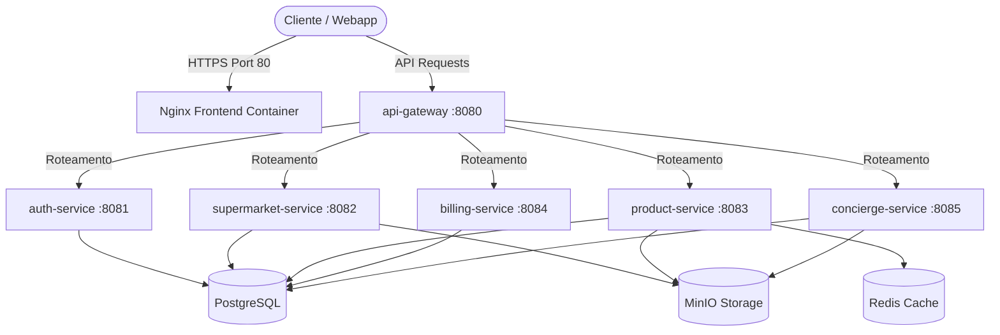

# 🏛️ Arquitetura Técnica — SmartMarket

> **Versão:** 3.0.0
> **Data:** 2026-05-25
> **Status:** Produção — Escopo Validado
> **Alinhado com:** REQUIREMENTS.md v3.0

---

## 1. Visão Geral da Arquitetura

O SmartMarket é uma plataforma B2B2C moderna projetada sob o estilo de **Microsserviços Autônomos**. Esta arquitetura separa os domínios de negócio mais críticos em módulos computacionais independentes, assegurando alta resiliência, escalabilidade elástica individual e isolamento completo de falhas em produção.

### 1.1 Princípios Arquiteturais Adotados
*   **Database-per-Service Lógico:** No MVP, as bases residem sob a mesma instância do PostgreSQL para redução de custo operacional, mas mantêm isolamento estrito via **schemas de banco individuais**. Isso assegura que a separação física futura para bancos autônomos seja feita com impacto zero de código.
*   **Clean Architecture / Arquitetura Hexagonal:** Todos os microsserviços do backend são estruturados em camadas puras. O Domínio é o núcleo do sistema e não conhece detalhes de frameworks (Spring/JPA).
*   **Composição Client-Side Dinâmica (Whitelabel):** A identidade visual de cada supermercado parceiro (whitelabel) e os layouts decorativos (temas sazonais) são mesclados em tempo de execução no frontend Angular através de diretivas nativas reativas, eliminando a sobrecarga de processamento visual no servidor.

---

## 2. Stack Tecnológica Enterprise

| Camada | Tecnologia | Escopo |
|---|---|---|
| **API Gateway** | `api-gateway` (Spring Boot Gateway) | Reverse proxy, roteamento, controle de CORS central |
| **Backend Core** | Java 21 LTS + Spring Boot 3.4.x | Microsserviços de lógica operacional |
| **Segurança** | Spring Security + JWT Stateless | Autenticação RBAC integrada |
| **Frontend Runtime** | Angular 18+ + Nginx Alpine | SPA otimizada, mobile-first, compressão gzip ativa |
| **Banco de Dados** | PostgreSQL 16 | Banco relacional robusto com schemas separados |
| **Object Storage** | MinIO (S3 Compatible) | Upload de imagens e listagens |
| **Caching Layer** | Redis 7-Alpine | Cache de catálogo, ofertas geolocalizadas e sessões públicas |
| **Containerização** | Docker & Docker Compose | Padronização e orquestração de containers Linux |

---

## 3. Estrutura de Microsserviços (Backend)



### 3.1 Lista de Serviços
1.  **`api-gateway` (Porta 8080):** Centraliza as requisições e faz o roteamento inteligente para as APIs internas.
2.  **`auth-service` (Porta 8081):** Emissão de tokens JWT, cadastro de usuários e regras de controle de acesso (Roles: `ROLE_ADMIN`, `ROLE_GESTOR`).
3.  **`supermarket-service` (Porta 8082):** Controle de estabelecimentos, whitelabel de cores, gestão de filiais e geolocalização.
4.  **`product-service` (Porta 8083):** Mapeamento do catálogo global, categorias, vigência de ofertas e tabloides sazonais.
5.  **`billing-service` (Porta 8084):** Assinaturas saas, ciclos de faturamento (mensal, semestral, anual) e controle de quotas.
6.  **`concierge-service` (Porta 8085):** Upload de listas, enfileiramento inteligente com score de prioridade e painel de atendentes assistidos.

---

## 4. Padrões Arquiteturais de Código

### 4.1 Camadas do Código Hexagonal (Clean Architecture)
```text
[service]/
├── domain/
│   ├── model/         → Entidades e objetos de valor puros (sem anotações Spring/JPA)
│   ├── repository/    → Ports de persistência (interfaces)
│   └── exception/     → Exceções específicas do domínio de negócio
├── application/
│   ├── usecase/       → Implementação das regras de negócio (casos de uso)
│   └── dto/           → Estruturas de entrada/saída (Data Transfer Objects)
└── infrastructure/
    ├── persistence/   → Entidades JPA, adaptadores Spring Data, Mappers (MapStruct)
    ├── web/           → REST Controllers e Tratadores Globais de Exceção
    └── config/        → Beans do Spring, segurança e conexões externas
```

---

## 5. Fluxos Críticos e Detalhes de Implementação

### 5.1 Fila Inteligente e Score de Prioridade (`concierge-service`)
As solicitações enviadas pelos supermercados são organizadas dinamicamente na Fila Inteligente. O score de prioridade de cada chamado é atualizado periodicamente pela fórmula:

$$\text{Score} = (0.4 \times \text{Urgência}) + (0.3 \times \text{Plano}) + (0.2 \times \text{Espera}) - (0.1 \times \text{Complexidade})$$

*   **Urgência:** Tempo restante até o fim da SLA contratada do plano.
*   **Lock de Concorrência:** Para evitar que dois atendentes assumam a mesma listagem, aplicamos uma trava atômica a nível transacional no banco:
    ```sql
    UPDATE solicitacoes SET status = 'EM_PROCESSAMENTO', atendente_id = :atendenteId, lock_at = NOW() 
    WHERE id = :id AND status = 'PENDENTE';
    ```

### 5.2 Geolocalização Euclidiana por Haversine (PostgreSQL)
A exibição das lojas e ofertas mais próximas é feita por um cálculo radial direto na base PostgreSQL, minimizando a latência:

```sql
SELECT s.*, 
  (6371 * acos(cos(radians(:lat)) * cos(radians(s.latitude))
   * cos(radians(s.longitude) - radians(:lng))
   + sin(radians(:lat)) * sin(radians(s.latitude)))) AS distance_km
FROM supermarkets s
WHERE s.status = 'ATIVO'
HAVING distance_km <= :radiusLimit
ORDER BY distance_km ASC;
```

### 5.3 Caching Redis e TTL Estratégico
O caching de leitura é utilizado nas APIs públicas do frontend com invalidação baseada em TTL para garantir tempo de carregamento inferior a 300ms:

| Estrutura de Chave | TTL | Estratégia de Invalidação |
|---|---|---|
| `categories:all` | 300s | TTL Simples |
| `nearby:lat:lng:r` | 60s | TTL Curto (localização móvel) |
| `flyer:active:{supermarketId}` | 120s | `@CacheEvict` explícito na ativação/exclusão de encartes |

---

## 6. Riscos Arquiteturais e Débitos Técnicos

1.  **Comunicação Síncrona:** A comunicação entre o `concierge-service` e o `billing-service` para verificar o SLA das assinaturas é síncrona via requisições HTTP REST diretas.
    *   *Risco:* Acoplamento temporário. Se o serviço de billing estiver offline, o concierge pode falhar na priorização.
    *   *Melhoria recomendada:* Adotar mensageria assíncrona (RabbitMQ) e arquitetura orientada a eventos pós-MVP.
2.  **Locks concorrentes no banco:** O controle de locks na Fila Inteligente do concierge direto na base relacional pode se tornar gargalo sob alto volume de atendimentos concorrentes.
    *   *Melhoria recomendada:* Migrar o controle de locks para chaves distribuídas usando Redis Redlock.
