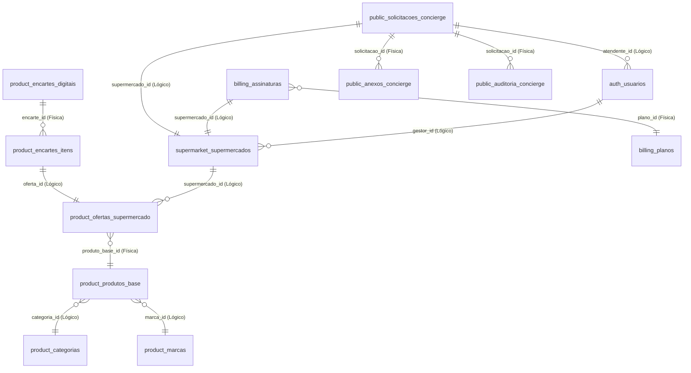

# 🗄️ Dicionário e Modelo de Dados do Banco de Dados — SmartMarket

Este documento serve como a **Fonte de Verdade Técnica** para o banco de dados PostgreSQL unificado da plataforma **SmartMarket**. Ele detalha os schemas lógicos, tabelas, colunas, tipos de dados, restrições (Constraints) e relacionamentos cruzados lógicos.

> **Regra de Uso:** Sempre consulte este arquivo antes de escrever qualquer instrução DDL (Data Definition Language) ou DML (Data Manipulation Language) em novos scripts de migração (Flyway) ou seeds SQL. Mantenha este documento atualizado a cada alteração de schema.

---

## 🏛️ Desenho de Schemas e Isolamento de Microsserviços

O SmartMarket adota o padrão **Database-per-Service** (Bancos por Serviço). No MVP, os serviços compartilham fisicamente o mesmo banco PostgreSQL (`smartmarket`) por motivos de custo e facilidade operacional, mas mantêm **isolamento lógico estrito** através de schemas PostgreSQL dedicados:

```text
smartmarket (Banco Único PostgreSQL)
├── 🔐 Schema: auth         → Tabelas de credenciais, papéis e tokens (auth-service)
├── 🛒 Schema: supermarket  → Tabelas de lojas, geolocalização e filiais (supermarket-service)
├── 🏷️ Schema: product      → Catálogo global, marcas, categorias, ofertas e encartes (product-service)
├── 💳 Schema: billing      → Tabelas de assinaturas, planos, histórico e pagamentos (billing-service)
└── 🌍 Schema: public       → Tabelas da Fila Inteligente do Concierge (concierge-service)
```

> [!IMPORTANT]
> **INTEGRIDADE DE MICROSSERVIÇOS:** Nunca crie chaves estrangeiras (`FOREIGN KEY`) físicas que cruzem schemas diferentes (ex: ligar `product.ofertas_supermercado` a `supermarket.supermercados`). O relacionamento deve ser **estritamente lógico** (usando IDs do tipo `UUID`), permitindo a extração física de bancos no futuro sem quebrar o sistema.

---

## 📚 Dicionário de Dados Completo

---

### 1. 🔐 Schema: `auth`
Gerencia credenciais, sessões e níveis de permissão (RBAC).

#### 1.1 Tabela: `auth.usuarios`
Armazena a conta de todos os usuários administrativos da plataforma (Gestores, Admins e Atendentes).

| Coluna | Tipo | Restrições | Descrição |
| :--- | :--- | :--- | :--- |
| `id` | `UUID` | `PRIMARY KEY` | Identificador único do usuário |
| `nome` | `VARCHAR(255)` | `NOT NULL` | Nome completo do usuário |
| `email` | `VARCHAR(255)` | `NOT NULL, UNIQUE` | E-mail do usuário (usado para login) |
| `senha_hash` | `VARCHAR(255)` | `NOT NULL` | Senha criptografada (BCrypt) |
| `status` | `VARCHAR(50)` | `NOT NULL` | Status da conta: `ATIVO`, `INATIVO`, `PENDENTE` |
| `ultimo_login_em`| `TIMESTAMP` | - | Data/hora do último login realizado |
| `criado_em` | `TIMESTAMP` | `NOT NULL, DEFAULT now()`| Data de criação do registro |
| `atualizado_em` | `TIMESTAMP` | - | Data da última atualização |

#### 1.2 Tabela: `auth.papeis`
Registra os papéis/perfis de permissão do sistema (RBAC).

| Coluna | Tipo | Restrições | Descrição |
| :--- | :--- | :--- | :--- |
| `id` | `UUID` | `PRIMARY KEY` | Identificador único do papel |
| `nome` | `VARCHAR(50)` | `NOT NULL, UNIQUE` | Nome do papel: `ROLE_ADMIN`, `ROLE_GESTOR`, `ROLE_CLIENTE`, `ROLE_ATENDENTE` |
| `descricao` | `VARCHAR(255)` | - | Descrição curta do escopo de permissões |

#### 1.3 Tabela: `auth.usuarios_papeis`
Tabela associativa para mapeamento de relacionamento Many-to-Many entre usuários e papéis.

| Coluna | Tipo | Restrições | Descrição |
| :--- | :--- | :--- | :--- |
| `usuario_id` | `UUID` | `PK, FK -> auth.usuarios(id)` | Identificador do usuário |
| `papel_id` | `UUID` | `PK, FK -> auth.papeis(id)` | Identificador do papel |

#### 1.4 Tabela: `auth.refresh_tokens`
Armazena tokens de atualização para autenticação persistente JWT.

| Coluna | Tipo | Restrições | Descrição |
| :--- | :--- | :--- | :--- |
| `id` | `UUID` | `PRIMARY KEY` | Identificador único do token |
| `usuario_id` | `UUID` | `NOT NULL, UNIQUE, FK -> auth.usuarios(id)` | Usuário dono do token |
| `token` | `VARCHAR(255)`| `NOT NULL, UNIQUE` | String do refresh token gerado |
| `data_expiracao` | `TIMESTAMP WITH TIME ZONE`| `NOT NULL` | Data limite de validade do token |

---

### 2. 🛒 Schema: `supermarket`
Gerencia estabelecimentos comerciais, identidades visuais whitelabel e coordenadas.

#### 2.1 Tabela: `supermarket.supermercados`
Armazena os dados cadastrais e configurações whitelabel de cada loja parceira.

| Coluna | Tipo | Restrições | Descrição |
| :--- | :--- | :--- | :--- |
| `id` | `UUID` | `PRIMARY KEY` | Identificador único do supermercado |
| `nome_fantasia` | `VARCHAR(255)` | `NOT NULL` | Nome exibido na vitrine pública |
| `cnpj` | `VARCHAR(14)` | `NOT NULL, UNIQUE` | Cadastro de Pessoa Jurídica da loja |
| `status` | `VARCHAR(50)` | `NOT NULL` | Status da loja: `PENDENTE`, `ATIVO`, `SUSPENSO` |
| `endereco` | `TEXT` | `NOT NULL` | Endereço físico completo da sede |
| `latitude` | `DOUBLE PRECISION`| - | Latitude geográfica para geolocalização |
| `longitude` | `DOUBLE PRECISION`| - | Longitude geográfica para geolocalização |
| `raio_atuacao` | `INT` | - | Raio máximo de cobertura em metros |
| `gestor_id` | `UUID` | `NOT NULL` | ID do usuário dono (Lógica -> `auth.usuarios.id`) |
| `url_logomarca` | `VARCHAR(500)` | - | URL pública da logo armazenada no MinIO |
| `cor_primaria_hex`| `VARCHAR(7)` | - | Cor primária da marca (whitelabel) |
| `cor_secundaria_hex`| `VARCHAR(7)` | - | Cor secundária da marca (whitelabel) |
| `email` | `VARCHAR(255)` | - | E-mail corporativo de contato |
| `telefone` | `VARCHAR(20)` | - | Telefone comercial de contato |
| `cep` | `VARCHAR(10)` | - | Código de Endereçamento Postal |
| `cidade` | `VARCHAR(100)` | - | Cidade da sede da loja |
| `estado` | `VARCHAR(2)` | - | Estado (UF) da sede |
| `criado_em` | `TIMESTAMP` | `NOT NULL, DEFAULT now()`| Data de criação |
| `atualizado_em` | `TIMESTAMP` | - | Data de atualização |

*   *Índices:* `idx_supermercado_gestor` no campo `gestor_id`.

#### 2.2 Tabela: `supermarket.estados`
Tabela auxiliar contendo os estados brasileiros para validação.

| Coluna | Tipo | Restrições | Descrição |
| :--- | :--- | :--- | :--- |
| `id` | `SERIAL` | `PRIMARY KEY` | Auto-incremento |
| `uf` | `VARCHAR(2)` | `NOT NULL, UNIQUE` | Sigla do Estado (ex: SP, RJ) |
| `nome` | `VARCHAR(100)` | `NOT NULL` | Nome completo do Estado (ex: São Paulo) |

#### 2.3 Tabela: `supermarket.filiais`
Armazena filiais/unidades físicas de uma rede de supermercado.

| Coluna | Tipo | Restrições | Descrição |
| :--- | :--- | :--- | :--- |
| `id` | `UUID` | `PRIMARY KEY` | Identificador único da filial |
| `supermercado_id`| `UUID` | `NOT NULL, FK -> supermarket.supermercados(id) ON DELETE CASCADE` | ID da matriz / supermercado pai |
| `nome` | `VARCHAR(255)` | `NOT NULL` | Nome identificador da filial (ex: Filial Centro) |
| `endereco` | `TEXT` | `NOT NULL` | Endereço físico completo |
| `cep` | `VARCHAR(10)` | - | CEP |
| `cidade` | `VARCHAR(100)` | - | Cidade |
| `estado` | `VARCHAR(2)` | - | Estado |
| `latitude` | `DOUBLE PRECISION`| - | Latitude para geolocalização |
| `longitude` | `DOUBLE PRECISION`| - | Longitude para geolocalização |
| `telefone` | `VARCHAR(20)` | - | Telefone |
| `email` | `VARCHAR(255)` | - | E-mail |
| `ativo` | `BOOLEAN` | `NOT NULL, DEFAULT TRUE`| Flag de status ativo |
| `criado_em` | `TIMESTAMP` | `NOT NULL, DEFAULT now()`| Data de criação |
| `atualizado_em` | `TIMESTAMP` | - | Data de atualização |

*   *Índices:* `idx_filial_supermercado` no campo `supermercado_id`.

---

### 3. 🏷️ Schema: `product`
Gerencia categorias de produtos, marcas parceiras, produtos base unificados, ofertas e encartes sazonais.

#### 3.1 Tabela: `product.categorias`
Categorias globais para organização do catálogo de produtos base.

| Coluna | Tipo | Restrições | Descrição |
| :--- | :--- | :--- | :--- |
| `id` | `UUID` | `PRIMARY KEY, DEFAULT gen_random_uuid()` | Identificador único |
| `nome` | `VARCHAR(100)` | `NOT NULL` | Nome da categoria (ex: Hortifruti) |
| `ativo` | `BOOLEAN` | `NOT NULL, DEFAULT TRUE` | Status ativo |
| `criado_em` | `TIMESTAMP WITH TIME ZONE`| `DEFAULT now()` | Data de criação |

*   *Índices:* `idx_categorias_nome` (UNIQUE) no campo `nome`.

#### 3.2 Tabela: `product.marcas`
Marcas globais de produtos cadastrados.

| Coluna | Tipo | Restrições | Descrição |
| :--- | :--- | :--- | :--- |
| `id` | `UUID` | `PRIMARY KEY, DEFAULT gen_random_uuid()` | Identificador único |
| `nome` | `VARCHAR(100)` | `NOT NULL` | Nome comercial (ex: Nestlé) |
| `ativo` | `BOOLEAN` | `NOT NULL, DEFAULT TRUE` | Status ativo |
| `criado_em` | `TIMESTAMP WITH TIME ZONE`| `DEFAULT now()` | Data de criação |

*   *Índices:* `idx_marcas_nome` (UNIQUE) no campo `nome`.

#### 3.3 Tabela: `product.produtos_base`
Catálogo unificado de mercadorias mantido pela SmartMarket (evita duplicidade no cadastro por supermercados).

| Coluna | Tipo | Restrições | Descrição |
| :--- | :--- | :--- | :--- |
| `id` | `UUID` | `PRIMARY KEY` | Identificador único do produto |
| `nome` | `VARCHAR(255)` | `NOT NULL` | Nome comercial completo (ex: Refrigerante Lata 350ml) |
| `descricao` | `TEXT` | - | Detalhes ou descrição técnica do produto |
| `marca` | `VARCHAR(100)` | - | (Legado) Nome da marca em formato texto simples |
| `unidade_medida` | `VARCHAR(20)` | `NOT NULL` | Unidade: `UN`, `KG`, `L`, `ML`, `PACOTE` |
| `peso_volume` | `DOUBLE PRECISION`| - | Peso ou volume unitário (ex: 350.0) |
| `url_imagem` | `VARCHAR(500)` | - | URL da imagem do produto no MinIO |
| `categoria_id` | `UUID` | - | ID da Categoria (Lógica -> `product.categorias.id`) |
| `marca_id` | `UUID` | - | ID da Marca (Lógica -> `product.marcas.id`) |
| `ativo` | `BOOLEAN` | `NOT NULL, DEFAULT TRUE` | Flag de status ativo |
| `criado_em` | `TIMESTAMP` | `NOT NULL, DEFAULT now()`| Data de cadastro |
| `atualizado_em` | `TIMESTAMP` | - | Data da última alteração |

#### 3.4 Tabela: `product.ofertas_supermercado`
Associa produtos base a preços e datas promocionais estipuladas por supermercados.

| Coluna | Tipo | Restrições | Descrição |
| :--- | :--- | :--- | :--- |
| `id` | `UUID` | `PRIMARY KEY` | Identificador único da oferta |
| `supermercado_id`| `UUID` | `NOT NULL` | Supermercado dono (Lógica -> `supermarket.supermercados.id`) |
| `produto_base_id`| `UUID` | `NOT NULL, FK -> product.produtos_base(id) ON DELETE CASCADE` | Produto base referenciado |
| `preco_atual` | `NUMERIC(10, 2)`| `NOT NULL` | Preço regular no estabelecimento |
| `preco_promocional`| `NUMERIC(10, 2)`| - | Preço com desconto aplicado |
| `data_inicio_promocao`| `TIMESTAMP` | - | Data de vigência inicial da promoção |
| `data_fim_promocao`| `TIMESTAMP` | - | Data de validade final do desconto |
| `ativo` | `BOOLEAN` | `NOT NULL, DEFAULT TRUE` | Status ativo |
| `criado_em` | `TIMESTAMP` | `NOT NULL, DEFAULT now()`| Data de criação |
| `atualizado_em` | `TIMESTAMP` | - | Data de alteração |

*   *Índices:* `idx_oferta_unica_ativa` (UNIQUE) nos campos `(supermercado_id, produto_base_id) WHERE ativo = true` (Impede duas ofertas ativas para o mesmo item no mesmo supermercado).

#### 3.5 Tabela: `product.temas_encarte`
Temas visuais criados pelo Administrador SmartMarket para embelezar encartes sazonais.

| Coluna | Tipo | Restrições | Descrição |
| :--- | :--- | :--- | :--- |
| `id` | `UUID` | `PRIMARY KEY` | Identificador único do tema |
| `nome` | `VARCHAR(255)` | `NOT NULL` | Nome identificador (ex: Natal Modelo, Dia das Mães) |
| `url_background_decorativo`| `VARCHAR(500)`| - | URL de background decorativo no MinIO |
| `cor_fundo_hex` | `VARCHAR(7)` | - | Cor de fundo em formato HEX (ex: `#b91c1c`) |
| `cor_destaque_hex`| `VARCHAR(7)` | - | Cor de destaque em formato HEX (ex: `#ffae00`) |
| `ativo` | `BOOLEAN` | `NOT NULL, DEFAULT TRUE` | Tema elegível para uso |
| `criado_em` | `TIMESTAMP` | `NOT NULL` | Data de criação |

#### 3.6 Tabela: `product.encartes_digitais`
Cabeçalho do tabloide digital montado pelo supermercado.

| Coluna | Tipo | Restrições | Descrição |
| :--- | :--- | :--- | :--- |
| `id` | `UUID` | `PRIMARY KEY` | Identificador único do encarte |
| `supermercado_id`| `UUID` | `NOT NULL` | Loja dona (Lógica -> `supermarket.supermercados.id`) |
| `tema_id` | `UUID` | `FK -> product.temas_encarte(id)` | Tema decorativo associado |
| `titulo` | `VARCHAR(255)` | `NOT NULL` | Título do tabloide (ex: Especial Churrasco do Fim de Semana) |
| `data_inicio` | `TIMESTAMP` | `NOT NULL` | Data inicial de divulgação |
| `data_fim` | `TIMESTAMP` | `NOT NULL` | Data de validade final |
| `status` | `VARCHAR(50)` | `NOT NULL` | Estado do tabloide: `RASCUNHO`, `ATIVO`, `ENCERRADO` |
| `criado_em` | `TIMESTAMP` | `NOT NULL` | Data de criação |
| `atualizado_em` | `TIMESTAMP` | - | Data de modificação |

#### 3.7 Tabela: `product.encartes_itens`
Mapeamento Many-to-Many conectando ofertas ao encarte, especificando regras de destaque e visualização.

| Coluna | Tipo | Restrições | Descrição |
| :--- | :--- | :--- | :--- |
| `id` | `UUID` | `PRIMARY KEY` | Identificador único do item |
| `encarte_id` | `UUID` | `NOT NULL, FK -> product.encartes_digitais(id)` | Encarte pai correspondente |
| `oferta_id` | `UUID` | `NOT NULL` | Oferta vinculada (Lógica -> `product.ofertas_supermercado.id`) |
| `ordem_exibicao` | `INTEGER` | - | Ordenação visual na grade do encarte (L2R) |
| `destaque` | `BOOLEAN` | - | Se `TRUE`, renderiza o item com proporção maior no layout |

---

### 4. 💳 Schema: `billing`
Gerencia a bilhetagem, planos de assinatura, pagamentos e métricas financeiras.

#### 4.1 Tabela: `billing.planos` (Tabelas de CRUD e Validação em Português)
Tabela principal que mapeia as regras dos planos definidos nos requisitos.

| Coluna | Tipo | Restrições | Descrição |
| :--- | :--- | :--- | :--- |
| `id` | `UUID` | `PRIMARY KEY` | Identificador único do plano |
| `nome` | `VARCHAR(100)` | `NOT NULL, UNIQUE` | Nome do plano: `STARTER`, `ESSENCIAL`, `PRO`, `PREMIUM` |
| `limite_ofertas_mensais` | `INTEGER` | - | Limite máximo de ofertas permitidas no mês |
| `limite_encartes_ativos` | `INTEGER` | - | Máximo de encartes publicados simultaneamente |
| `raio_atuacao_km` | `INTEGER` | - | Limite do raio geoespacial para vitrine |
| `limite_notificacoes_mensais`| `INTEGER` | - | Limite mensal de envio de notificações push |
| `possui_concierge` | `BOOLEAN` | `NOT NULL, DEFAULT FALSE`| Habilita upload na fila do concierge |
| `concierge_uploads_mensais` | `INTEGER` | - | Cota mensal para envio de listagens |
| `sla_atendimento_horas` | `INTEGER` | - | Horas de garantia de processamento (SLA) |
| `prioridade_fila` | `VARCHAR(20)` | - | Prioridade: `BAIXA`, `NORMAL`, `ALTA`, `MAXIMA` |
| `preco_mensal` | `NUMERIC(10, 2)`| `NOT NULL` | Valor para ciclo mensal |
| `preco_semestral` | `NUMERIC(10, 2)`| `NOT NULL` | Valor para ciclo semestral |
| `preco_anual` | `NUMERIC(10, 2)`| `NOT NULL` | Valor para ciclo anual |
| `ativo` | `BOOLEAN` | `NOT NULL, DEFAULT TRUE`| Status de comercialização do plano |

#### 4.2 Tabela: `billing.assinaturas` (Assinatura do Supermercado em Português)
Armazena o plano e validade contratual ativa de um determinado supermercado.

| Coluna | Tipo | Restrições | Descrição |
| :--- | :--- | :--- | :--- |
| `id` | `UUID` | `PRIMARY KEY` | Identificador único da assinatura |
| `supermercado_id`| `UUID` | `NOT NULL` | ID do supermercado (Lógica -> `supermarket.supermercados.id`) |
| `plano_id` | `UUID` | `NOT NULL, FK -> billing.planos(id)`| Plano contratado |
| `ciclo` | `VARCHAR(20)` | `NOT NULL` | Ciclo: `MENSAL`, `SEMESTRAL`, `ANUAL` |
| `status` | `VARCHAR(30)` | `NOT NULL` | Status: `ATIVA`, `INADIMPLENTE`, `CANCELADA`, `EXPIRADA` |
| `data_inicio` | `TIMESTAMP WITH TIME ZONE`| `NOT NULL` | Data/hora de início de vigência |
| `data_fim` | `TIMESTAMP WITH TIME ZONE`| - | Data/hora de encerramento contratual |
| `renovacao_automatica` | `BOOLEAN` | `NOT NULL, DEFAULT TRUE` | Flag de autorrenovação na cobrança recorrente |

#### 4.3 Tabela: `billing.plans` (Inglês - Dashboard e Retrocompatibilidade)
Versão equivalente das configurações de planos em inglês para o motor legado de faturamento.

| Coluna | Tipo | Restrições | Descrição |
| :--- | :--- | :--- | :--- |
| `id` | `UUID` | `PRIMARY KEY` | Auto-gerado se omitido |
| `name` | `VARCHAR(100)` | `NOT NULL` | Nome |
| `description` | `TEXT` | - | Descrição curta |
| `price` | `DECIMAL(10, 2)`| `NOT NULL` | Preço base cadastrado |
| `billing_cycle` | `VARCHAR(20)` | `NOT NULL` | `monthly`, `semiannual`, `annual` |
| `max_offers` | `INT` | `NOT NULL` | Limite de ofertas |
| `max_push_notifications`| `INT` | `NOT NULL` | Limite de push |
| `allow_customer_preferences`| `BOOLEAN` | `NOT NULL, DEFAULT FALSE`| Customização de preferências do cliente |
| `trial_days` | `INT` | `NOT NULL, DEFAULT 0`| Período gratuito em dias |
| `active` | `BOOLEAN` | `NOT NULL, DEFAULT TRUE` | Status ativo |
| `created_at`/`updated_at`| `TIMESTAMP` | `DEFAULT now()` | Auditoria |

#### 4.4 Tabela: `billing.subscriptions` (Inglês)
Tabela mapeando o tenant supermercado com o plano legado.

| Coluna | Tipo | Restrições | Descrição |
| :--- | :--- | :--- | :--- |
| `id` | `UUID` | `PRIMARY KEY` | Identificador |
| `supermarket_id`| `UUID` | `NOT NULL` | ID do Supermercado |
| `plan_id` | `UUID` | `NOT NULL, FK -> billing.plans(id)` | Plano inglês correspondente |
| `status` | `VARCHAR(20)` | `NOT NULL` | `active`, `pending`, `canceled`, `expired`, `trialing` |
| `start_date` | `TIMESTAMP` | `NOT NULL` | Início |
| `end_date`/`renewal_date`| `TIMESTAMP` | - | Final de vigência e próxima cobrança |
| `auto_renew` | `BOOLEAN` | `NOT NULL, DEFAULT TRUE` | Renovação automática |

*   *Índices:*
    *   `idx_sub_supermarket` no campo `supermarket_id`.
    *   `idx_sub_status_renewal` no campo `(status, renewal_date)`.
    *   `idx_unique_active_sub` (UNIQUE) no campo `(supermarket_id) WHERE status IN ('active', 'trialing')`.

#### 4.5 Tabela: `billing.payments`
Registro de tentativas e faturas liquidadas de assinaturas.

| Coluna | Tipo | Restrições | Descrição |
| :--- | :--- | :--- | :--- |
| `id` | `UUID` | `PRIMARY KEY` | Identificador único do pagamento |
| `subscription_id`| `UUID` | `NOT NULL, FK -> billing.subscriptions(id) ON DELETE CASCADE` | Assinatura cobrada |
| `amount` | `DECIMAL(10, 2)`| `NOT NULL` | Valor líquido cobrado |
| `payment_method`| `VARCHAR(20)` | `NOT NULL` | Método: `pix`, `credit_card`, `boleto` |
| `status` | `VARCHAR(20)` | `NOT NULL` | Status da fatura: `paid`, `pending`, `failed`, `refunded` |
| `transaction_id`| `VARCHAR(255)`| `UNIQUE` | ID da transação no Gateway externo (ex: Stripe/Asaas) |
| `payment_date` | `TIMESTAMP` | - | Data da liquidação |
| `created_at` | `TIMESTAMP` | `DEFAULT now()` | Data de emissão da fatura |

#### 4.6 Tabela: `billing.plan_usage`
Controlador mensal de consumo de cota por supermercado para bloqueio ou faturamento adicional.

| Coluna | Tipo | Restrições | Descrição |
| :--- | :--- | :--- | :--- |
| `id` | `UUID` | `PRIMARY KEY` | Identificador único |
| `subscription_id`| `UUID` | `NOT NULL, FK -> billing.subscriptions(id) ON DELETE CASCADE` | Assinatura avaliada |
| `reference_month`| `DATE` | `NOT NULL` | Mês de competência (ex: `2026-05-01`) |
| `offers_used` | `INT` | `NOT NULL, DEFAULT 0`| Total de ofertas cadastradas no mês corrente |
| `push_notifications_used`| `INT` | `NOT NULL, DEFAULT 0`| Total de pushes disparados no mês |

*   *Índices:* `idx_usage_lookup` no campo `(subscription_id, reference_month)` e restrição única `uq_sub_month`.

#### 4.7 Tabela: `billing.subscription_history`
Trilha histórica de auditoria de assinaturas para relatórios de Churn e MRR.

| Coluna | Tipo | Restrições | Descrição |
| :--- | :--- | :--- | :--- |
| `id` | `UUID` | `PRIMARY KEY` | Identificador |
| `subscription_id`| `UUID` | `NOT NULL, FK -> billing.subscriptions(id) ON DELETE CASCADE` | Assinatura afetada |
| `old_plan_id` | `UUID` | `FK -> billing.plans(id) ON DELETE SET NULL` | Plano de origem |
| `new_plan_id` | `UUID` | `FK -> billing.plans(id) ON DELETE SET NULL` | Plano de destino |
| `action` | `VARCHAR(50)` | `NOT NULL` | Ação: `created`, `upgraded`, `downgraded`, `canceled`, `renewed`, `expired` |
| `reason` | `TEXT` | - | Motivo informado pelo usuário ou log do sistema |
| `changed_at` | `TIMESTAMP` | `DEFAULT now()` | Instante da operação |

---

### 5. 🌍 Schema: `public`
Utilizado pelo `concierge-service` para gerenciar a fila e arquivos da operação assistida.

#### 5.1 Tabela: `public.solicitacoes_concierge`
Armazena o cabeçalho e score de priorização das solicitações de digitação enviadas pelos gestores de lojas.

| Coluna | Tipo | Restrições | Descrição |
| :--- | :--- | :--- | :--- |
| `id` | `UUID` | `PRIMARY KEY` | Identificador único da solicitação |
| `supermercado_id`| `UUID` | `NOT NULL` | Supermercado solicitante (Lógica -> `supermarket.supermercados.id`) |
| `atendente_id` | `UUID` | - | Atendente responsável (Lógica -> `auth.usuarios.id`) |
| `titulo` | `VARCHAR(255)` | `NOT NULL` | Título resumo da solicitação |
| `status` | `VARCHAR(50)` | `NOT NULL, DEFAULT 'PENDENTE'` | Estado: `PENDENTE`, `EM_PROCESSAMENTO`, `AGUARDANDO_APROVACAO`, `APROVADO`, `REJEITADO`, `PUBLICADO` |
| `sla_definido_horas`| `INTEGER` | `NOT NULL, DEFAULT 3` | Prazo contratual de atendimento |
| `prioridade_score`| `NUMERIC(10, 4)`| `DEFAULT 0` | Score calculado dinamicamente pelo algoritmo |
| `complexidade` | `INTEGER` | `DEFAULT 1` | Peso de itens: `1 (Pequeno)`, `2 (Médio)`, `3 (Grande)` |
| `plano_cliente` | `VARCHAR(50)` | `DEFAULT 'BASICO'` | Nome do plano no ato (ex: Starter, Essencial, Pro, Premium) |
| `data_criacao` | `TIMESTAMP` | `NOT NULL, DEFAULT now()`| Data/hora do envio do arquivo |
| `data_inicio_processamento`| `TIMESTAMP` | - | Instante em que o atendente assume a tarefa |
| `data_conclusao` | `TIMESTAMP` | - | Instante de finalização da tarefa |
| `lock_at` | `TIMESTAMP` | - | Timestamp para bloqueio concorrente na fila |
| `url_arquivo_original`| `VARCHAR(1024)`| - | URL do arquivo original bruto enviado no MinIO |
| `observacoes` | `TEXT` | - | Instruções adicionais enviadas pelo Gestor |

*   *Índices:* `idx_solicitacao_supermercado` no campo `supermercado_id`, `idx_solicitacao_status` e `idx_solicitacao_atendente`.

#### 5.2 Tabela: `public.anexos_concierge`
Caminho físico de planilhas Excel, CSV ou imagens de tabloides associados a uma digitação Concierge.

| Coluna | Tipo | Restrições | Descrição |
| :--- | :--- | :--- | :--- |
| `id` | `UUID` | `PRIMARY KEY` | Identificador único do anexo |
| `solicitacao_id` | `UUID` | `NOT NULL, FK -> public.solicitacoes_concierge(id) ON DELETE CASCADE` | Solicitação pai vinculada |
| `nome_arquivo` | `VARCHAR(255)` | `NOT NULL` | Nome original do arquivo enviado (ex: ofertas_natal.xlsx) |
| `url_minio` | `VARCHAR(1024)`| `NOT NULL` | Endpoint absoluto do asset no MinIO |
| `tipo_mime` | `VARCHAR(100)` | - | Formato do anexo (ex: `application/vnd.openxmlformats-officedocument.spreadsheetml.sheet`) |
| `tamanho_bytes` | `BIGINT` | - | Tamanho físico do arquivo em bytes |
| `data_upload` | `TIMESTAMP` | `NOT NULL, DEFAULT now()`| Instante do upload |

#### 5.3 Tabela: `public.auditoria_concierge`
Trilha de auditoria detalhada que rastreia os tempos de processamento e ações manuais sobre cada lote.

| Coluna | Tipo | Restrições | Descrição |
| :--- | :--- | :--- | :--- |
| `id` | `UUID` | `PRIMARY KEY` | Identificador único |
| `solicitacao_id` | `UUID` | `NOT NULL, FK -> public.solicitacoes_concierge(id) ON DELETE CASCADE` | Solicitação afetada |
| `usuario_id` | `UUID` | `NOT NULL` | Usuário autor da ação (Lógica -> `auth.usuarios.id`) |
| `acao` | `VARCHAR(100)` | `NOT NULL` | Ação executada (ex: `LOCK_CLAIMED`, `PREVIEW_GENERATED`, `STATUS_CHANGED`) |
| `status_de` | `VARCHAR(50)` | - | Estado anterior na transição |
| `status_para` | `VARCHAR(50)` | - | Estado posterior na transição |
| `detalhes` | `TEXT` | - | Detalhes em formato livre ou JSON da auditoria |
| `timestamp` | `TIMESTAMP` | `NOT NULL, DEFAULT now()`| Instante da ação |

---

## 🔗 Relacionamentos Cruzados Lógicos (Cross-Schema Links)

Para preservar o isolamento necessário de microsserviços e permitir a futura quebra para bancos físicos independentes, **todos os relacionamentos inter-schemas são mantidos em nível lógico na aplicação**, utilizando o tipo `UUID`.

Abaixo estão descritas as conexões lógicas de chave:



---

## ⚠️ Alerta Crítico: Discrepâncias no Script de Seed Local (`seed_data.sql`)

> [!WARNING]
> O arquivo local de dados de seed (`infra/scripts/seed_data.sql`) contém instruções baseadas em uma versão antiga do schema em que as tabelas eram mantidas no singular.
> 
> * **Tabela de Supermercados:** O seed tenta fazer insert em `supermarket.supermercado`, enquanto a migração real do Flyway cria `supermarket.supermercados` (plural).
> * **Tabela de Temas:** O seed usa `product.tema_encarte`, enquanto a migração cria `product.temas_encarte`.
> * **Tabela de Produtos Base:** O seed usa `product.produto_base`, enquanto a migração real cria `product.produtos_base`.
> * **Tabela de Ofertas:** O seed usa `product.oferta`, enquanto a migração cria `product.ofertas_supermercado`.
> * **Tabela Join de Encartes:** O seed tenta associar em `product.encartes_digitais_ofertas`, enquanto o modelo real de banco usa a tabela de associação direta `product.encartes_itens` para mapear os itens do tabloide.
>
> **Ação Recomendada:** Sempre execute e crie migrações baseando-se estritamente no dicionário acima (que condiz com o validador JPA/Flyway) e, caso precise rodar seeds locais, adapte-os previamente para os nomes corretos mapeados em plural.
