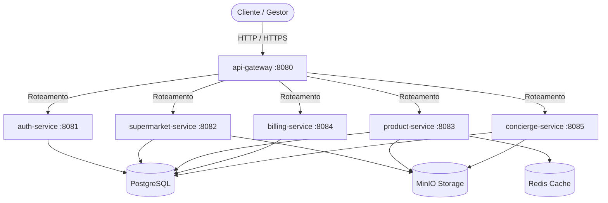
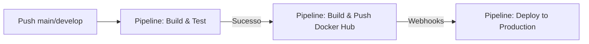

# 🛒 SmartMarket — Plataforma SaaS B2B2C

[](https://openjdk.org/)
[](https://spring.io/projects/spring-boot)
[](https://angular.dev/)
[](https://nginx.org/)
[](https://www.postgresql.org/)

O **SmartMarket** é uma plataforma SaaS B2B2C inovadora e mobile-first, desenhada com foco em **Product-Led Growth (PLG)**. O sistema conecta supermercados locais diretamente a seus clientes através de encartes digitais dinâmicos, ofertas geolocalizadas e personalização de identidade visual da marca (whitelabel) sem nenhuma barreira de entrada ou fricção de login para o usuário final.

---

## 🏛️ Arquitetura de Software e Tecnologias

O SmartMarket é construído sobre uma **Arquitetura de Microsserviços autônomos**, integrados através de um API Gateway unificado e com dados logicamente isolados via schemas no PostgreSQL.



### 1. Backend (Java 21 LTS & Spring Boot 3.4.x)
*   **Padrão de Código:** Clean Architecture / Arquitetura Hexagonal (Domain, Application, Infrastructure).
    *   *Domínio Puro:* A camada `domain` é 100% isolada e livre de anotações do Spring, Hibernate ou JPA.
    *   *Mapeamento:* Utilização estrita de **MapStruct** para conversão bidirecional entre `Domain Model ↔ DTO ↔ JPA Entity`.
    *   *Injeção:* Apenas injeção via construtores, facilitada por Lombok `@RequiredArgsConstructor` (sem `@Autowired` em campos).
*   **Bancos de Dados & Armazenamento:**
    *   *PostgreSQL 16:* Banco único compartilhado logicamente via schemas isolados para cada domínio (`auth`, `supermarket`, `catalog`, `offer`, `flyer`, `analytics`, `concierge`), garantindo independência futura para migração para microserviços puros (*Database-per-Service*).
    *   *Flyway:* Migrações versionadas e controladas por código.
    *   *Redis:* Caching em duas camadas de rotas públicas, com agrupamento regional em cache para otimização de buscas locais.
    *   *MinIO:* Armazenamento de arquivos e assets de imagens de produtos, marcas e uploads de concierge.

### 2. Frontend (Angular 18+ & Tailwind CSS)
*   **Servidor Web de Produção:** Migrado para **Nginx Alpine** usando build multi-stage altamente otimizado com compressão gzip ativa, SPA routing nativo (`try_files`) e cabeçalhos avançados de segurança HTTP.
*   **Gerenciamento de Estado:** Abordagem altamente reativa usando **Signals** e **RxJS** de forma combinada.
*   **Design System & UI:** Customização visual whitelabel em tempo de execução via diretivas do Angular que injetam variáveis CSS da marca da loja (`--color-primary`, `--color-secondary`), além de skeletons customizados e layout otimizado mobile-first.

---

## 📂 Estrutura do Workspace

```text
smart-market/
├── .gemini/              # Regras de arquitetura, compliance, design system e qualidade
│   ├── _quality/         # Quality Gates e regras para PRs
│   ├── testing/          # Diretrizes para cobertura e qualidade de testes
│   ├── ARCHITECTURE.md   # Definição técnica detalhada da infraestrutura e microsserviços
│   └── REQUIREMENTS.md   # Requisitos funcionais, não funcionais e regras de negócio
├── backend/              # Microsserviços Spring Boot (Java 21)
│   ├── api-gateway/      # Ponto de entrada unificado da plataforma
│   └── services/         # Módulos de regras de negócio (auth, supermarket, product, billing, concierge)
├── frontend/             # Aplicação SPA Angular 18+
│   └── smartmarket-web/  # Workspace do frontend com Tailwind, Signals e Material
├── infra/                # Docker, Compose e Scripts de Operação
│   ├── compose/          # Arquivos yaml do Docker Compose (local e overrides)
│   └── scripts/          # Scripts PowerShell utilitários de gerência de ambiente
└── docs/                 # Documentações complementares e relatórios de cobertura
```

---

## 🚀 Como Executar o Projeto Localmente

### Pré-requisitos
*   **Java 21 LTS** instalado
*   **Node.js 20+** e **npm** instalados
*   **Docker** & **Docker Compose** instalados
*   **Maven 3.9+** instalado

### Passo 1: Compilar o Backend
Os containers do Docker esperam que os arquivos `.jar` de cada serviço tenham sido gerados na fase de compilação local do Maven.

Na raiz do diretório `backend/`, execute:
```bash
mvn clean package -DskipTests
```

### Passo 2: Subir a Infraestrutura e Microsserviços via Docker Compose
O SmartMarket fornece scripts robustos de PowerShell para configurar o ecossistema. 

Na raiz do projeto, execute o script para subir todos os containers (incluindo o Frontend otimizado com Nginx na porta 80):
```powershell
.\infra\scripts\up-local.ps1
```
*Este comando iniciará o PostgreSQL, Redis, MinIO com buckets prontos (`smartmarket-products`, `smartmarket-brands` etc.) e todos os microsserviços por trás do API Gateway.*

### Passo 3: Popular Massa de Testes (Seed Data)
Para testar a plataforma imediatamente com usuários, marcas de supermercado, temas sazonais e ofertas ativas:
```powershell
Get-Content .\infra\scripts\seed_data.sql | docker exec -i smartmarket-postgres psql -U smartmarket -d smartmarket
```

### Passo 4: Executar o Frontend Angular (Ambiente de Desenvolvimento)
Se preferir rodar o frontend Angular de forma interativa com Hot Reload na porta 4200:
1. Entre na pasta correspondente:
   ```bash
   cd frontend/smartmarket-web
   ```
2. Instale as dependências com npm:
   ```bash
   npm install
   ```
3. Execute o servidor de desenvolvimento apontando para as rotas do proxy:
   ```bash
   ng serve --proxy-config proxy.conf.json
   ```
4. Abra o navegador em [http://localhost:4200/login](http://localhost:4200/login)

* **Credenciais de Teste (Gestor de Supermercado):**
  * **Login:** `gestor@smartmarket.com`
  * **Senha:** `password`
* **Credenciais de Teste (Administrador Global):**
  * **Login:** `admin@smartmarket.com`
  * **Senha:** `password`

---

## ⚠️ Padrões de Qualidade & Quality Gates

Todas as contribuições de código (PRs) no repositório do SmartMarket devem cumprir rigorosamente as métricas especificadas em `.gemini/_quality/QUALITY-GATES.md`:

### 🎯 Quality Gates do Frontend (Angular & Jasmine/Karma)
*   **Sem DI Antiga:** Proibido injetar dependências no construtor via `constructor(private ...)`. Use obrigatoriamente a função **`inject()`**.
*   **Novos Fluxos de Controle:** Proibido diretivas estruturais antigas (`*ngIf`, `*ngFor`). Use exclusivamente a nova sintaxe nativa **`@if`**, **`@for`** e **`@switch`**.
*   **Templates Separados:** Nada de templates inline nas classes TS. Todo HTML de componente deve ficar em seu respectivo arquivo `.html`.
*   **Signals em Estado Local:** Use **`signal()`** em vez de `BehaviorSubject` para gerenciar estados internos reativos.
*   **Uso de Design System:** Proibido declarar cores hex/rgb no código CSS. Use sempre as variáveis do design system ou classes de cor semânticas do Tailwind.

### 🎯 Quality Gates do Backend (Java, JUnit & JaCoCo)
*   **Limpeza do Domínio:** Nenhuma classe do pacote `domain/` pode importar annotations ou pacotes do Spring Framework, JPA ou Hibernate.
*   **Mapeamento com MapStruct:** Conversões de entidades e DTOs devem ser geradas em tempo de compilação via interfaces `@Mapper`.
*   **Health Check & APIs:** Todo controller deve ter documentação Swagger/OpenAPI ativa e mapeamento explícito de nomes em `@PathVariable` e `@RequestParam`.

---

## 📈 Cobertura de Testes e Relatórios

### Executando Testes de Backend e JaCoCo:
Para validar a lógica dos microsserviços e gerar o status de cobertura de código do backend:
```bash
cd backend
mvn clean test
```
*   **Relatório Geral Agregado:** Para gerar um relatório consolidado em markdown, execute:
    ```powershell
    .\backend\generate_coverage_report.ps1
    ```
    *O relatório final será gerado em [docs/test_coverage_report.md](./docs/test_coverage_report.md).*

### Executando Testes de Frontend:
Para validar as páginas e componentes Angular utilizando Chrome Headless no ambiente de CI:
```bash
cd frontend/smartmarket-web
npm run test
```
*Para gerar o relatório de cobertura de código do frontend:*
```bash
npm run test:coverage
```

---

## 📦 Pipelines CI/CD & Deploy Automatizado

A esteira de integração contínua é gerenciada por workflows do **GitHub Actions**:



1.  **Build & Test (`build-and-test.yml`):** Compila o código Java e Angular, executa testes unitários headless rápidos e exporta relatórios de cobertura do JaCoCo e Karma.
2.  **Build & Push (`build-and-push.yml`):** Executado em pushes nas branches principais. Cria imagens Docker multi-stage otimizadas e realiza a publicação automatizada no **Docker Hub** com a tag do hash do commit (`github.sha`) e `latest`.
3.  **Deploy to Production (`deploy.yml`):** Realiza o pull das imagens mais recentes do Docker Hub sob o servidor de produção, substitui os containers de forma segura e aplica as restart policies (`unless-stopped`).

---

## 🔗 Links Úteis e Documentação Complementar

*   🛠️ [Guia Detalhado de Infraestrutura Local e MinIO](./infra/README.md)
*   📋 [Requisitos de Negócio & Escopo do MVP](./.gemini/REQUIREMENTS.md)
*   🏛️ [Especificação de Arquitetura Técnica](./.gemini/ARCHITECTURE.md)
*   🎨 [Manual do Design System](./.gemini/design-system.md)
*   🧱 [Manual da Arquitetura Angular](./.gemini/frontend-architecture.md)
*   🔏 [Diretrizes de Compliance LGPD](./.gemini/lgpd/)
