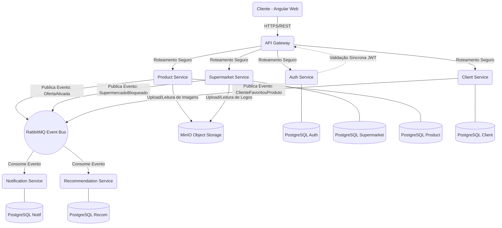

# 🏛️ Arquitetura Técnica — SmartMarket

Este documento detalha a arquitetura técnica da plataforma SmartMarket, abordando os padrões adotados, o fluxo de comunicação entre os microserviços, a stack tecnológica e as decisões de design.

---

## 1. Visão Geral da Arquitetura

O SmartMarket utiliza uma **Arquitetura de Microserviços** baseada em contêineres, com um modelo **API-First**. O sistema é dividido em serviços independentes por domínio de negócio (Bounded Contexts), garantindo alta escalabilidade, resiliência e independência de deploy.

A arquitetura geral segue o padrão **API Gateway**, onde todas as requisições de clientes externos (Web/Mobile) passam por um ponto único de entrada antes de serem roteadas para os serviços internos.

---

## 2. Stack Tecnológica Detalhada

### 2.1 Backend (Microserviços)
* **Linguagem:** Java 21 LTS
* **Framework Principal:** Spring Boot 3.x
* **Segurança:** Spring Security + JWT (JSON Web Tokens)
* **Persistência:** Spring Data JPA + Hibernate
* **Migração de Banco de Dados:** Flyway
* **Comunicação Síncrona:** Spring Cloud OpenFeign / WebClient
* **Comunicação Assíncrona:** RabbitMQ (Message Broker para eventos de domínio)
* **Documentação de API:** OpenAPI 3.0 (Swagger UI)

### 2.2 Frontend
* **Framework:** Angular 18+
* **Linguagem:** TypeScript
* **UI/UX:** Angular Material + Tailwind CSS
* **Gerenciamento de Estado:** Signals / RxJS

### 2.3 Banco de Dados e Armazenamento
* **Banco de Dados Relacional:** PostgreSQL 16 (Padrão Database-per-Service)
* **Object Storage (Arquivos/Imagens):** MinIO (Compatível com AWS S3 API)
* **Cache (Futuro):** Redis (para catálogo de produtos e promoções)

### 2.4 Infraestrutura, DevOps e Observabilidade
* **Containerização:** Docker
* **Orquestração Local:** Docker Compose
* **Orquestração de Produção (Futuro):** Kubernetes (K8s)
* **CI/CD:** GitHub Actions
* **Métricas e Monitoramento:** Prometheus + Grafana (via Spring Boot Actuator)
* **Tracing Distribuído:** OpenTelemetry + Jaeger/Zipkin
* **Centralização de Logs:** ELK Stack (Elasticsearch, Logstash, Kibana) ou Loki

---

## 3. Padrões Arquiteturais Adotados

1. **Database per Service:** Cada microserviço possui seu próprio schema/banco de dados isolado. Nenhum serviço acessa o banco de outro diretamente.
2. **API Gateway:** Centraliza autenticação inicial, rate limiting, CORS e roteamento.
3. **Clean Architecture / Hexagonal:** O código dos serviços é estruturado para isolar a regra de negócio (Domínio) da infraestrutura (Bancos, APIs externas).
4. **Event-Driven Architecture (EDA):** Uso de eventos assíncronos para manter a consistência eventual e disparar ações cruzadas (ex: enviar notificação quando uma promoção é ativada).
5. **Stateless Authentication:** Uso de JWT para autenticação. O estado do usuário não é guardado no servidor; o token contém as *claims* necessárias.
6. **Correlation ID:** Um ID único gerado no API Gateway que trafega por todos os serviços e logs para facilitar o rastreamento de requisições (*Distributed Tracing*).

---

## 4. Estrutura Interna dos Microserviços (Clean Architecture)

Cada microserviço backend é estruturado nas seguintes camadas:

* **`domain` (Domínio):** O coração do software. Contém Entidades, Enums, Value Objects e as Interfaces de Repositório. **Não possui dependências de frameworks externos** (nem Spring, nem JPA).
* **`application` (Aplicação/Casos de Uso):** Contém as regras de negócio orquestradas (UseCases) e DTOs. Coordena o fluxo de dados entre o domínio e as portas.
* **`infrastructure` (Infraestrutura):** Implementa as interfaces do domínio. Contém:
    * `persistence`: Entidades JPA, Repositórios do Spring Data, Mapeadores (Mapper) e Adaptadores.
    * `web`: Controllers REST (Endpoints), Tratamento de Exceções Globais.
    * `security`: Filtros de segurança locais (JWT).
    * `messaging`: Producers e Consumers de mensageria (RabbitMQ).
    * `clients`: Clientes HTTP (Feign) para falar com outros microserviços.

---

## 5. Padrões de Comunicação entre Microserviços

A comunicação entre os serviços ocorre de duas formas principais, dependendo do caso de uso:

### 5.1 Comunicação Síncrona (REST / Feign)
Utilizada para consultas (**Leituras**) que requerem resposta imediata para a interface do usuário ou quando uma validação imediata é imprescindível.
* **Exemplo:** O `api-gateway` valida o token JWT sincronicamente delegando (ou repassando) as validações iniciais, ou quando o `client-service` precisa buscar detalhes em tempo real do catálogo no `product-service`.
* **Resiliência:** Implementada com *Circuit Breakers* (Resilience4j) e *Retries* para evitar falhas em cascata caso o serviço de destino esteja fora do ar.

### 5.2 Comunicação Assíncrona (Mensageria / Eventos)
Utilizada para comandos de **Escrita** ou processos que não exigem resposta em tempo real, garantindo baixo acoplamento e consistência eventual. Utilizaremos o **RabbitMQ** como *Message Broker*.
* **Exemplo 1 (Notificações):** Quando uma oferta é ativada pelo supermercado, um evento `OfferActivatedEvent` é publicado. O `notification-service` consome esse evento e inicia o disparo de Pushes para clientes na região (Geofencing).
* **Exemplo 2 (Auditoria e Analytics):** O `client-service` publica um evento `ProductVisualizedEvent` quando um cliente abre um produto. O `recommendation-service` consome isso em background para treinar seu algoritmo de recomendações.

---

## 6. Diagrama de Comunicação (Macro)

---

## 7. Gestão de Arquivos e Imagens (MinIO)

A plataforma utiliza o MinIO para armazenar assets binários, organizados em buckets específicos para garantir isolamento e performance.

### 7.1 Organização de Buckets
*   `smartmarket-products`: Imagens do catálogo global de produtos (gerido pelo Admin).
*   `smartmarket-brands`: Logomarcas dos supermercados (Whitelabel).
*   `smartmarket-themes`: Assets visuais de temas sazonais (Natal, Páscoa, etc).

### 7.2 Fluxo de Upload e Leitura
* **Upload:** O microserviço responsável (ex: `supermarket-service` para logos) recebe o arquivo via `MultipartFile`, gera um UUID único e o armazena no bucket correspondente.
* **Leitura:** O microserviço retorna a URL pública do asset. O Frontend Angular consome essa URL diretamente para renderização, reduzindo o tráfego nos microserviços.

---

## 8. Customização Visual (Whitelabel e Temas)

O sistema foi desenhado para permitir que cada supermercado mantenha sua identidade visual enquanto aproveita campanhas globais.

1.  **Identidade da Loja:** O `supermarket-service` armazena a `urlLogomarca`, `corPrimariaHex` e `corSecundariaHex`.
2.  **Temas Sazonais:** O `product-service` gerencia a entidade `TemaEncarte`. Um tema define backgrounds e cores decorativas.
3.  **Composição do Encarte:** Ao criar um `EncarteDigital`, o gestor associa a sua loja, escolhe um tema e seleciona as ofertas. O Frontend mescla as cores da loja com os elementos visuais do tema.

---

## 9. Fluxo de Segurança (Autenticação e Autorização)

1. O Cliente faz o Login (`POST /api/v1/auth/login`) enviando credenciais pelo API Gateway.
2. O API Gateway roteia para o `auth-service`.
3. O `auth-service` valida o hash da senha no banco e gera um token JWT contendo `userId`, `email` e `roles` (Ex: `ROLE_ADMIN`, `ROLE_GESTOR`, `ROLE_CLIENTE`).
4. O Cliente recebe o JWT e o armazena no frontend.
5. Nas próximas requisições, o Cliente envia o cabeçalho `Authorization: Bearer <token>`.
6. O API Gateway valida a assinatura do JWT localmente. Se for válido, a requisição é processada com as permissões do *Role* associado.

---

## 10. Observabilidade e Monitoramento

* **Logs Centralizados:** Exportação de logs estruturados para o ELK Stack ou Grafana Loki.
* **Métricas de Saúde:** Endpoints do Actuator (`/actuator/prometheus`) para consumo pelo Prometheus/Grafana.
* **Distributed Tracing:** OpenTelemetry para rastreio de requisições entre microserviços.
